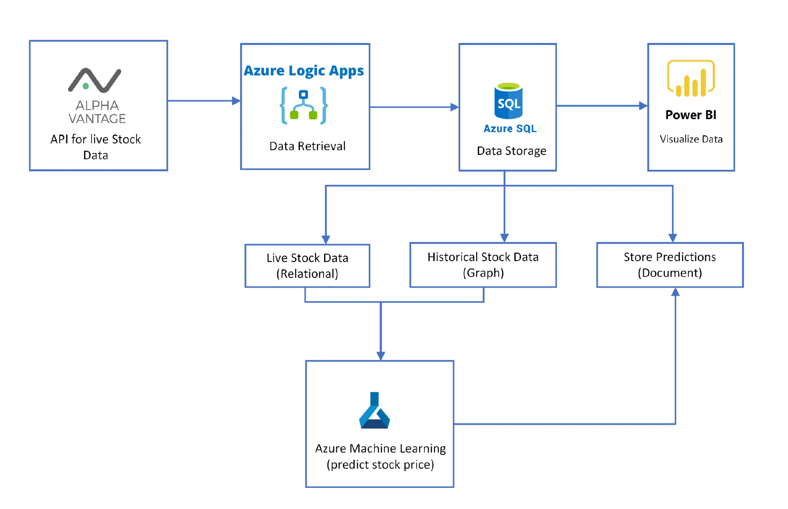

# Real-time Stock Market Analysis and Predictions using Azure SQL Database and Machine Learning

The objective of this project is to build a stock market analysis system that uses real-time
stock data from the Alpha Vantage API, Azure SQL Database, and Azure Machine Learning
to analyse trends and predict future stock prices. The system will help users make informed
investment decisions and improve their trading strategies.

## Architecture Diagram


## Technologies Used 
```
● Alpha Vantage API for retrieving real-time stock data
● Azure SQL Database for storing and querying the data
● Azure Machine Learning for analysing the data and making predictions
● Azure Power BI for creating interactive dashboards and visualisations
```